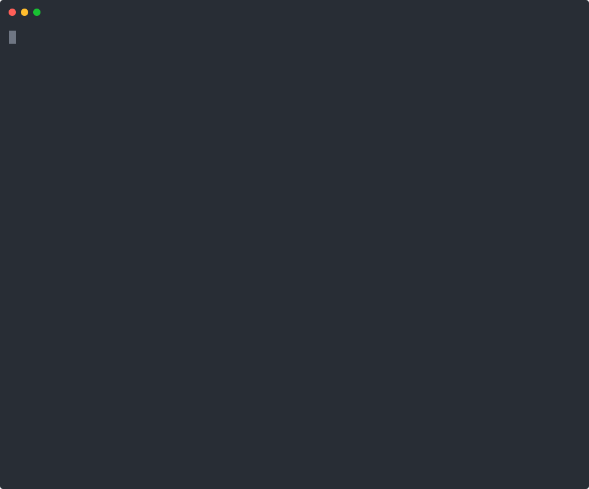

# leeward

A proxy that sits between your agent and everything it calls, so that a failure arrives as a usable answer instead of an error string.

An agent that calls a tool and gets back `Error: request failed` cannot tell a timeout worth retrying from a tool that no longer exists. So it retries both, spends its budget on the one that was never coming back, and ends the run with nothing to say. leeward stands in front of the call. It classifies what went wrong, decides whether waiting could possibly help, and answers with the last good copy where that is honest, or with a short note that says what is missing and what to do instead. The agent does not change.

## What it looks like

The same small agent, twice, with its MCP server killed underneath it mid session. On the
left it talks to the server directly. On the right it talks through `leeward wrap`. A local
model, real processes, a real `SIGKILL`, one take. `make recording` reruns it.



Without leeward the second call raises `MCPError: Connection closed` and the agent has
nothing to say. With leeward the same call returns the last good answer as `STALE`, with a
note saying the tool is gone and how old the copy is, and the agent answers the question and
passes the caveat on.

## The failures it handles

**The wedged call.** A request that connects and then hangs holds the run open until something else gives up. leeward returns at the hard deadline with the failure classified, and refuses the next call to that endpoint without touching the network once it knows the hang is not a one off.

**The vanished tool.** A server is redeployed without a tool, or the server process dies. A server reports an unknown tool the same way it reports a tool that crashed, so agents retry it. leeward confirms the tool has left `tools/list`, or that the connection really is closed, answers once with `TOOL_GONE`, and marks the tool permanent for the run.

**The permanent 429.** `Retry-After: 3600` inside a run with two minutes left is not a wait, it is a no. leeward spends one attempt on it and tells the rest of the run to stop asking.

## Measured

`make demo` arms each failure against the fakes in this repository and rewrites this table and the notes below from what came back. The HTTP cases run in process against a fake origin on a real socket. The MCP cases run `leeward wrap` and the fake server as separate processes, and the server drops a tool, hangs, or is killed with SIGKILL partway through. Attempts come from leeward's event log; "reached upstream" counts requests the origin read and tool calls the server ran, from the fakes' own counters.

<!-- demo:measured -->

Measured on macOS 26.6.2 on arm64 with 10 cores, Python 3.13.2, leeward 0.1.0, 2026-09-17.

| Case | Result | Time | Attempts | Reached upstream |
| --- | --- | --- | --- | --- |
| Origin hangs after connecting | `DOWN{WEDGED}`, 504, `DO_NOT_RETRY` | 30.01 s | 2 | 2 |
| Same endpoint, next call | `DOWN{BREAKER_OPEN}` carrying `WEDGED`, 504, `DO_NOT_RETRY` | 1.2 ms | 0 | 0 |
| 429 with `Retry-After: 3600` | `DOWN{QUOTA_EXHAUSTED}`, 503, `DO_NOT_RETRY` | 6.0 ms | 1 | 1 |
| Static page, origin down | `STALE`, 200, `PROCEED_WITH_CAUTION` | 1.3 ms | 0 | 0 |
| Live endpoint, origin down | `DOWN{CONNECT_REFUSED}`, 503, `TREAT_AS_UNKNOWN` | 107 ms | 2 | 0 |
| MCP tool hangs | `DOWN{WEDGED}`, `isError`, `RETRY_AFTER` | 30.02 s | 1 | 1 |
| MCP tool removed mid session | `DOWN{TOOL_GONE}`, `isError`, `DO_NOT_RETRY` | 9.2 ms | 1 | 0 |
| MCP server killed mid session | `DOWN{TOOL_GONE}`, `isError`, `DO_NOT_RETRY` | 3.5 ms | 1 | 0 |
| Same tool, next call | `DOWN{BREAKER_OPEN}` carrying `TOOL_GONE`, `isError`, `DO_NOT_RETRY` | 1.2 ms | 0 | 0 |
| Another tool on that server, next call | `FRESH`, `PROCEED` | 423 ms | 1 | 1 |
| `--cache` tool, server killed | `STALE`, `PROCEED_WITH_CAUTION` | 3.7 ms | 1 | 0 |

<!-- /demo:measured -->

<!-- demo:suite -->

The suite is 483 tests, 13 seconds on the machine above.

<!-- /demo:suite -->

CI runs the suite on Python 3.11 and 3.13, on Linux and macOS.

## Wiring

An MCP client starts a stdio server from a command line. Put `leeward wrap --` in front of that command:

```json
{
  "mcpServers": {
    "notes": {
      "command": "/Users/you/.venvs/leeward/bin/leeward",
      "args": [
        "wrap", "--cache", "read_text_file", "--",
        "npx", "-y", "@modelcontextprotocol/server-filesystem", "/Users/you/notes"
      ]
    }
  }
}
```

Without leeward, `command` would be `npx` and `args` would start at `-y`. That is the whole change. The client sees the server's own tools, prompts and resources, and leeward starts the server with the environment and working directory the client provides, so an `env` block keeps working. When the client ends the session, or stops leeward, leeward stops the server.

What changes is what a failure looks like:

- **A tool that disappears, or a server that dies,** gets one `DOWN{TOOL_GONE}` result that says it is permanent for this run, and later calls to that tool are refused without reaching the server. Other tools keep working; if the server died, the next call to one of them starts it again.
- **A call that hangs** returns `DOWN{WEDGED}` at the hard deadline, 30 seconds by default.
- **`--cache TOOL`** keeps that tool's successful results. When the server fails, the last one comes back as `STALE`, exactly as the server sent it, behind a note that says how old it is. Name only tools that are safe to call twice. leeward cannot tell from a name whether a tool has side effects, so it caches nothing unless asked, never caches a tool whose name reads like a write (`create_`, `delete_`, `send_` and similar), and warns at startup if `--cache` names one.
- **Every result** carries leeward's decision in `_meta` under `io.github.mithrilbytes.leeward/outcome`: the outcome, the failure class, the advice, and the age of anything served. A failed result also carries it in `structuredContent.leeward`, and so does a stale one when the tool's output schema has room for the key. Otherwise structured content stays exactly as the tool sent it, so output schemas still validate.
- **Every call** is an event in a JSONL log under `~/.leeward/events`. `leeward events` prints it and `leeward events --follow` tails it.

`--name` sets the server's name in events and rules (read off the command when it is not given, `server-filesystem` here), `--data-dir` moves the cache and the log, `--config` reads a `leeward.yaml` for rules and deadlines, and `--json` writes startup warnings as JSON lines on stderr, since stdout belongs to the client.

### With a configuration file

`leeward serve` runs the same machinery on a local port, and `leeward serve --json` reports where it listens as one JSON line. `leeward init` writes a starter `leeward.yaml`, and `leeward.example.yaml` has every setting with comments.

`leeward warm` fills the cache from the corpora in the configuration before anything needs it: a list of URLs you wrote, or a sitemap leeward reads itself. It is paced per host, capped in bytes, and resumable in the only way that cannot disagree with itself, by skipping whatever is already stored and fresh. `--dry-run` says what it would fetch and fetches nothing. robots.txt is consulted for URLs leeward discovered through a sitemap and not for a list you wrote down, and every warm event records which it was.

`leeward doctor` checks the wiring: configuration, rules, data directory, note templates, the event log, and which MCP client configurations actually start a server through `leeward wrap`. `leeward report` adds up the event log into calls, outcomes, attempts, latencies and how many calls were answered without reaching anyone. `leeward cache ls|stats|pin|rm` shows and prunes what is stored, and `leeward chaos arm|ls|clear` makes a failure happen on purpose, which is how the table above is produced. All of them read local state and open no connection.

**Everything else over HTTPS.** Turn on the forward proxy and point `HTTPS_PROXY` at it.

```yaml
surfaces: {forward: {enabled: true, listen: "127.0.0.1:8788"}}
```

`HTTPS_PROXY=http://127.0.0.1:8788` sends any client's HTTPS through leeward. A tunnel is opaque, so this mode owns the deadline, classifies DNS and connect failures and remembers them per host, and answers a failed tunnel with the outcome as JSON. It cannot cache, and it says so once per endpoint per run.

**Model calls.** Give a client an OpenAI compatible base URL and it goes out through the same engine, with tiers tried in order.

```yaml
surfaces: {llm: {enabled: true, tiers: [{name: primary, base_url: "https://api.example.com/v1", model: some-model, api_key_env: LLM_API_KEY}, {name: local, base_url: "http://127.0.0.1:11434/v1", model: "qwen2.5:7b-instruct-q4_K_M"}]}}
```

Point the client at `http://127.0.0.1:8787/v1`. A failure arrives in the provider's own error shape, with leeward's note as the message and the whole outcome under `error.leeward`, so a client library parses it rather than choking on it. The answer says which tier produced it, and which tiers it fell through on the way. Keys are read from the environment, never from the file. Model calls are not cached. Streaming works: leeward fails over between tiers before the first byte, and if a stream stops early it adds one more event saying why, so the client keeps what arrived and knows where it ended.

**MCP servers over HTTP.** Each configured server gets its own path, with the same tool names.

```yaml
surfaces: {mcp: {enabled: true, servers: {notes: {transport: stdio, command: ["python", "-m", "notes_server"]}}}}
```

Point the client at `http://127.0.0.1:8787/mcp/notes`.

**HTTP tools.** Give a tool a base URL that leads to a mount.

```yaml
surfaces: {fetch: {enabled: true, mounts: {wiki: "https://en.wikipedia.org"}}}
```

`GET http://127.0.0.1:8787/wiki/wiki/Foo` fetches the article, with `X-Leeward-Outcome`, `Age` and the note on the response.

## What a note looks like

Notes are what the model reads. They are capped at 400 characters, always prefixed, and never contain content from the origin. These three are verbatim from the run above.

<!-- demo:notes -->

```text
[leeward] STALE: served a copy stored 33ms ago because intel/incident_notes is
unreachable (TOOL_GONE). This endpoint is classified `volatile`, so the copy may be out
of date. Check anything time-sensitive. Retrying will not help for the rest of this run.

[leeward] DOWN: the tool `threat_intel_lookup` is gone from its MCP server (intel). This
is permanent for this run; further attempts will not succeed. Other tools on this server
are unaffected.

[leeward] DOWN: 127.0.0.1 returned nothing (WEDGED after 30s, 2 attempts). Retrying will
not help until connectivity returns.
```

<!-- /demo:notes -->

Beside every note, programs get the same decision as structured data: the outcome, the failure class, the advice, the age of anything served, and what was withheld.

## The live guarantee

Some values are only worth having if they are current. A wind reading from 40 minutes ago is not a wind reading, and an agent that treats it as one is worse than an agent that admits it does not know.

Mark those endpoints `class: live` and leeward will never serve them from cache, however badly the origin is failing. It says so, and it names the copy it is holding back rather than pretending none exists:

<!-- demo:note-live -->

```text
[leeward] DOWN: 127.0.0.1 returned nothing (CONNECT_REFUSED after 106ms, 2 attempts).
This endpoint is classified `live`: a cached value from 0s ago exists but is not being
served, because only the current value is meaningful here. Treat this value as unknown
and say so rather than estimating it.
```

<!-- /demo:note-live -->

No configuration option, request header or tool argument overrides this. Three independent places enforce it: the policy layer refuses to build a stale allowance for a live endpoint, the serving path checks again before it hands anything back, and the event log refuses to record a stale serve of a live endpoint at all. A property test asserts it across generated policies and cache states.

## How it decides

Deterministically, and it will show its work. There is no model in the data path.

- **Classification.** Nineteen failure classes, each derived from evidence rather than from a string match on the exception: DNS response codes, refused connections, TLS validation with a clock check, deadlines, HTTP status with rate limit headers, JSON-RPC codes, tool listings. `leeward classify <url|server/tool>` prints the policy and the rule that decided each part, without touching the network.
- **Disposition.** Every failure is `TRANSIENT`, `WAIT`, `NEVER` or `UNKNOWN`, with a scope: this request, this endpoint, this host, this run. A `NEVER` is remembered at its scope, so one refusal answers the rest of the run.
- **Attempts.** Exponential backoff with decorrelated jitter, a hedge at the soft deadline for calls that are safe to duplicate, and a per run budget on retries that cannot be exceeded.
- **Cache.** The subset of RFC 9111 that matters here, plus `stale-if-error` and `stale-while-revalidate` from RFC 5861, with per class limits on how old a copy may be. Bodies are content addressed and checked against their hash on read. Identical requests in flight collapse into one.
- **Breakers.** Per endpoint and per host, opened immediately by a `NEVER`, with half open backoff. A short circuit reports the original failure class, not a generic one.

Every outcome is an event in a JSONL log with credentials redacted, and `/leeward/status` and `/leeward/forecast` answer from local state, so they still work when everything they describe is unreachable.

## Prior art

Several projects sit between an MCP client and its servers, and what each is for differs more than where it sits. Everything below comes from each project's own documentation as of September 2026; check there for anything newer.

- **MCP's caching hints.** Since the 2026-07-28 revision, results of `tools/list`, `prompts/list`, `resources/list`, `resources/templates/list` and `resources/read` carry `ttlMs` and `cacheScope`, so a client can cache listings and reads ([changelog](https://modelcontextprotocol.io/specification/2026-07-28/changelog)). Tool call results are not among them, and the hints describe freshness rather than what to do when a server fails.
- **mcp-cache** ([duriandrivendesign/mcp-cache](https://github.com/duriandrivendesign/mcp-cache)) is the closest to `leeward wrap`, down to the command: `mcp-cache -- <command>`. It caches every successful `tools/call`, `resources/read` and `prompts/get` on disk, for 730 hours by default, and when the upstream fails it returns the last cached response even past that. leeward caches only the tools you name, limits how old a served copy may be by the endpoint's class, and puts a note on a stale answer.
- **ToolHive's Virtual MCP Server** ([docs](https://docs.stacklok.com/toolhive/guides-vmcp/)) combines several backend servers behind one endpoint, with centralized authentication, multi-step workflows, and circuit breaker and partial failure modes for backends that fail. It runs through the ToolHive Kubernetes operator or its local CLI.
- **MCPProxy** ([smart-mcp-proxy/mcpproxy-go](https://github.com/smart-mcp-proxy/mcpproxy-go)) federates many servers behind one proxy, gives the agent a single `retrieve_tools` function backed by BM25 search instead of every tool schema, and quarantines new servers until you approve them.
- **ContextForge** ([IBM/mcp-context-forge](https://github.com/IBM/mcp-context-forge)) is a registry and proxy that federates MCP, A2A and REST or gRPC APIs with central governance, discovery and observability, including auth, retries and rate limiting.

If you already run one of these, the overlap is real. leeward's narrower aim is the answer the model reads when a call fails: classified, bounded in age, and plain about what it does not know. It is not a general HTTP cache, which has no way to know that a stale wind reading is worse than none, and not a retry library, which has to be wired into every call site.

## Install

leeward is released on GitHub rather than PyPI, and needs Python 3.11 or later.

```bash
python3 -m venv ~/.venvs/leeward
~/.venvs/leeward/bin/pip install git+https://github.com/MithrilBytes/leeward@v0.1.0
~/.venvs/leeward/bin/leeward --version
```

The wiring above uses the full path to `leeward`, which works whatever `PATH` a client starts servers with.

From a checkout, with `PYTHON=python3.11` or similar if `python3.13` is not the interpreter you want:

```bash
make install    # .venv with the pinned development dependencies
make check      # lint, types and the test suite
make demo       # rerun the measured cases and rewrite them in this file
make dist       # build the sdist and wheel, then install and run the wheel in a new environment
```

## Status

`leeward wrap` fronts a stdio MCP server. `leeward serve` runs MCP servers over HTTP, HTTP tools and an OpenAI compatible model endpoint on one port, and a CONNECT proxy on another. `warm` fills the cache ahead of an outage, and `report`, `doctor`, `cache`, `chaos`, `classify` and `events` read and prod local state. Underneath: the classifier, breakers, run budgets, deadlines, the cache and its freshness rules, notes and outcomes, the event log, and `/leeward/status` and `/leeward/forecast`. Tested on Linux and macOS with Python 3.11 and 3.13.

Not built yet:

- `zim`, `directory` and `mcp_resources` corpora. `url_list` and `sitemap` work, on a cron schedule or when something goes down.

Known limits:

- Windows is unverified. The parts of leeward that were not portable are fixed, and the checks run there, but the suite cannot finish: the MCP SDK's stdio client stops a server by sending `SIGINT`, which Windows rejects, so every test that starts a real stdio server fails while shutting down.
- A CONNECT tunnel is opaque, so mode C classifies failures and owns deadlines but can never cache. leeward says so once per endpoint per run rather than on every call.
- A tool that keeps its name and changes its arguments is noticed and logged, and the client is asked for a fresh listing, but leeward cannot rewrite a call the agent already built.
- Run identity on the stateless 2026-07-28 revision of MCP comes from the caller: `_meta` under `io.github.mithrilbytes.leeward/run`, or an `X-Leeward-Run` header. Without either, everything on one connection shares a run, and for `leeward wrap` that means one process.

## License

Apache-2.0. See [LICENSE](LICENSE) and [NOTICE](NOTICE).
